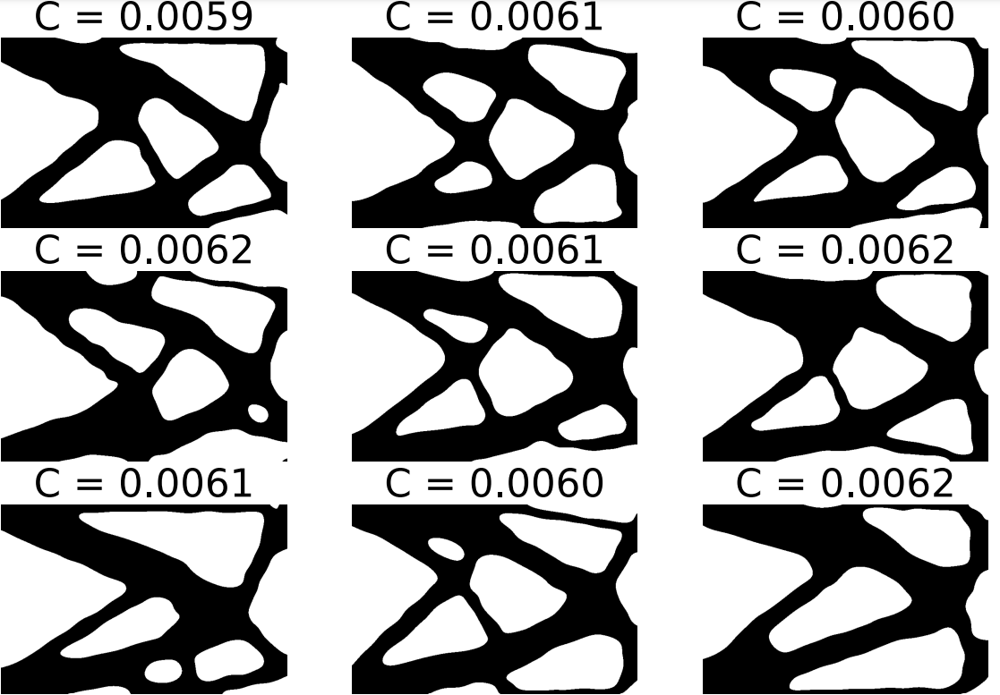
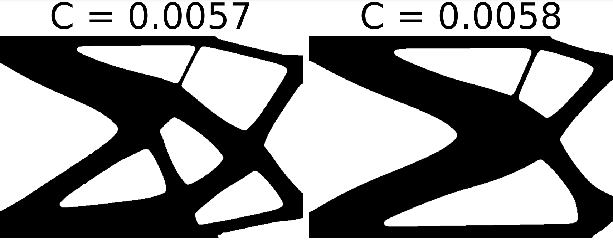
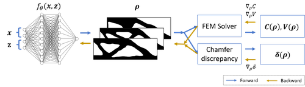
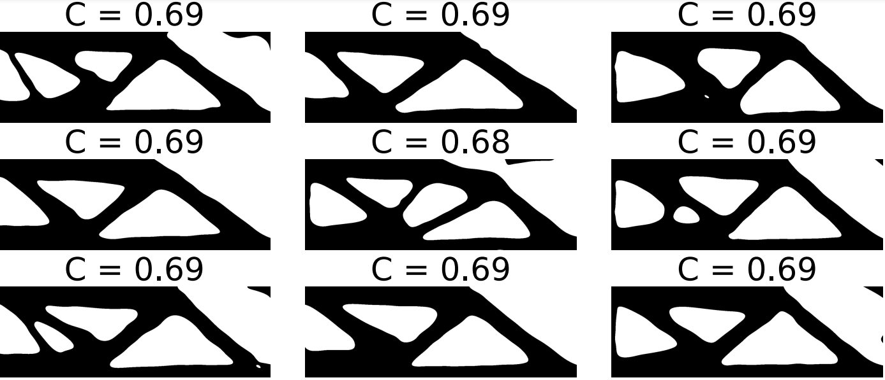
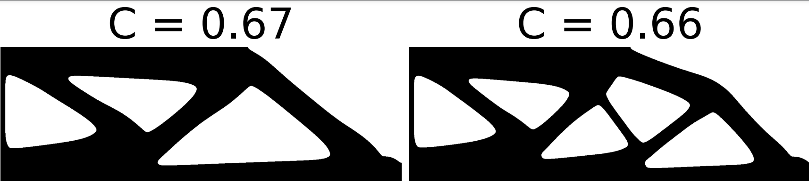

# Diverse Topology Optimization using Modulated Neural Fields

### TL;DR
**T**opology **O**ptimization using **M**odulated Neural Fields (TOM) is a novel method that uses neural fields, a solver-in-the-loop and an explicit diversity constraint to generate diverse and structurally compliant shapes without data.

- [ArXiv ](https://arxiv.org/abs/2502.13174)

- The code is combined with [Geometry-informed Neural Networks (GINNs)](https://github.com/ml-jku/GINNs-Geometry-informed-Neural-Networks).

---

## Abstract 

Topology optimization (TO) is a family of computational methods that derive near-optimal geometries from formal problem descriptions. 
Despite their success, established TO methods are limited to generating single solutions, restricting the exploration of alternative designs. 
To address this limitation, we introduce Topology Optimization using Modulated Neural Fields (TOM) - a data-free method that trains a neural network to generate structurally compliant shapes and explores diverse solutions through an explicit diversity constraint. 
The network is trained with a solver-in-the-loop, optimizing the material distribution in each iteration. 
The trained model produces diverse shapes that closely adhere to the design requirements. 
We validate TOM on 2D and 3D TO problems. 
Our results demonstrate that TOM produces more diverse solutions than any prior method while maintaining near-optimality and being an order of magnitude faster due to inherent parallelism. 
These findings open new avenues for engineering and design, offering enhanced flexibility and innovation in structural optimization.

<table style="width:1000px; border:none; border-collapse:collapse">
  <tr style="border:none">
    <td style="text-align:center; vertical-align:middle; width:50%; border:none;">
      
    </td>
    <td style="text-align:center; vertical-align:middle; width:50%; border:none;">
      
    </td>
  </tr>
</table>


## Method overview

We parametrize shapes with a conditional neural field.
In each iteration, the network receives mesh locations and modulation vectors as input.
It outputs densities for each shape at these mesh points.
These densities are then used by a solver to calculate compliances and volumes, along with their gradients.
The diversity loss is determined by comparing the surface points of the shapes using the chamfer discrepancy.
This comparison helps compute the diversity loss and its gradient.





## Results

The produced shapes are more diverse than the baselines.
TopoDiff ([ArXiv](https://arxiv.org/abs/2208.09591)) is a neural network which produces diverse shapes, but with a poor compliance.
The Deflated Barrier method ([ArXiv](https://arxiv.org/abs/2004.11797)) produces only 2 shapes with excellent compliance.

<table style="width:1000px; border:none; border-collapse:collapse">
  <tr style="border:none">
    <td style="text-align:center; vertical-align:middle; width:50%; border:none;">
      
    </td>
    <td style="text-align:center; vertical-align:middle; width:50%; border:none;">
      
    </td>
  </tr>
</table>


The method also scales to 3D were it produces diverse modes for a jet engine bracket.
The following figure shows 3 modes from top and perspective view.


## Citation

```
@article{radler2025TOM,
  title={Diverse Topology Optimization using Modulated Neural Fields},
  author={Radler, Andreas and Volkmann, Eric and Brandstetter, Johannes and Berzins, Arturs},
  journal={arXiv preprint arXiv:2502.13174},
  year={2025}
}
```

